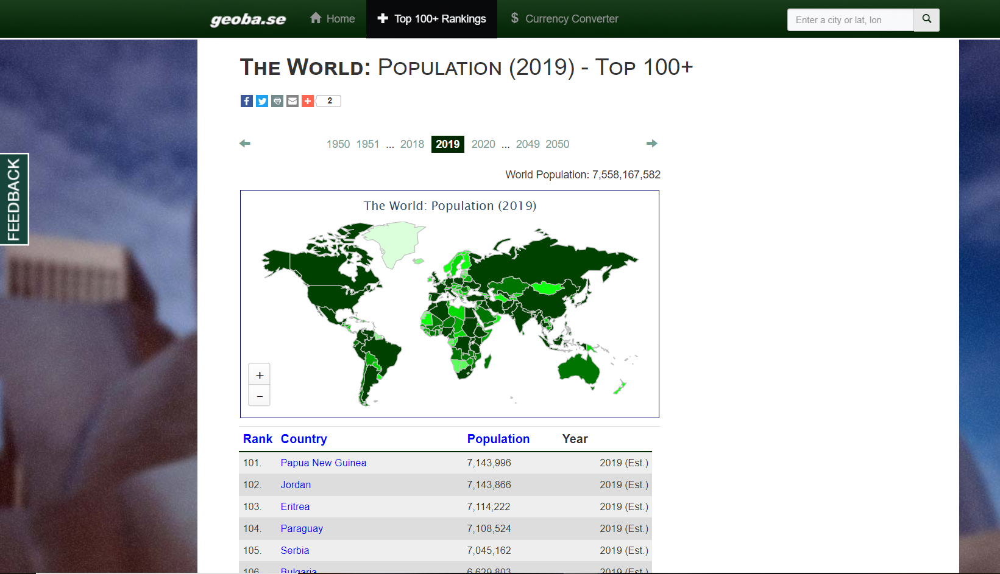
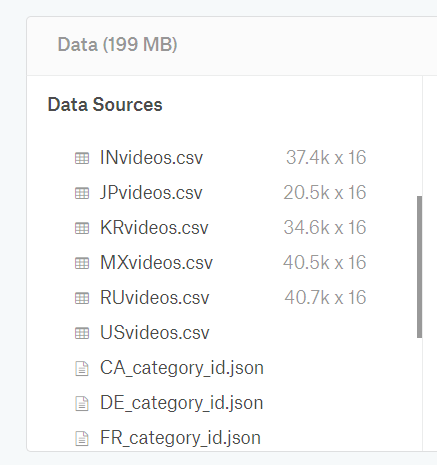
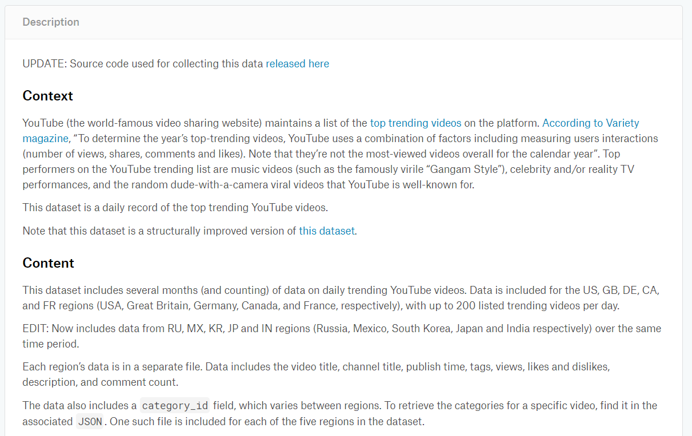
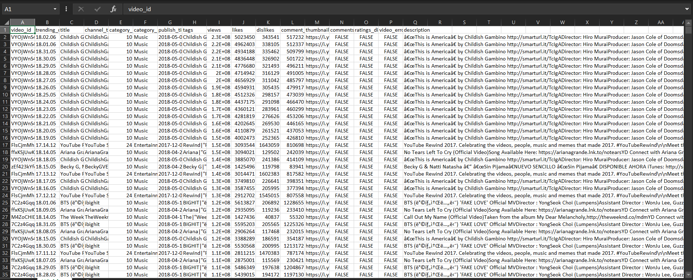
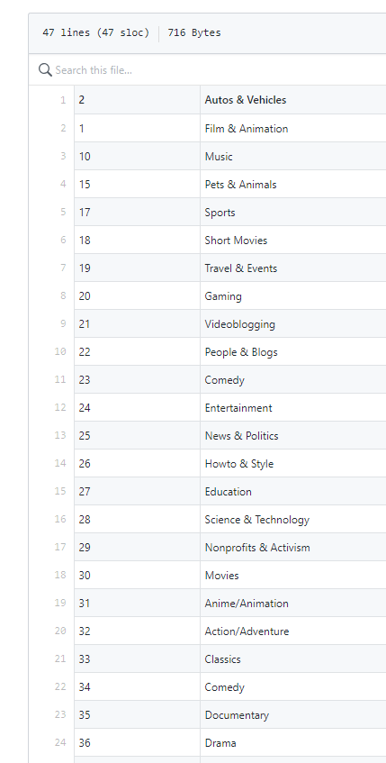
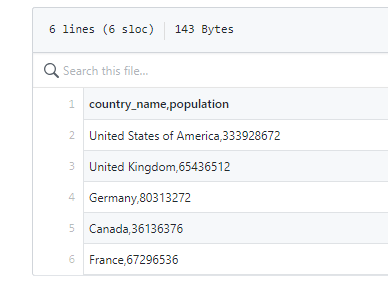
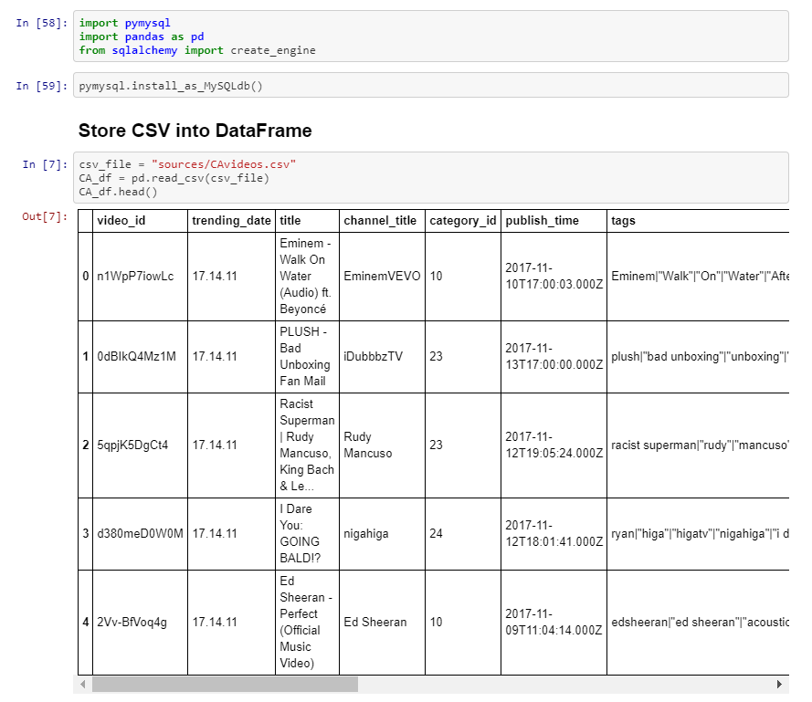
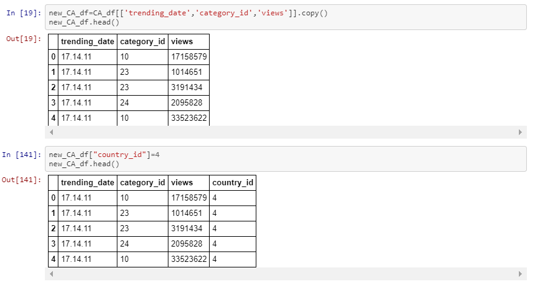
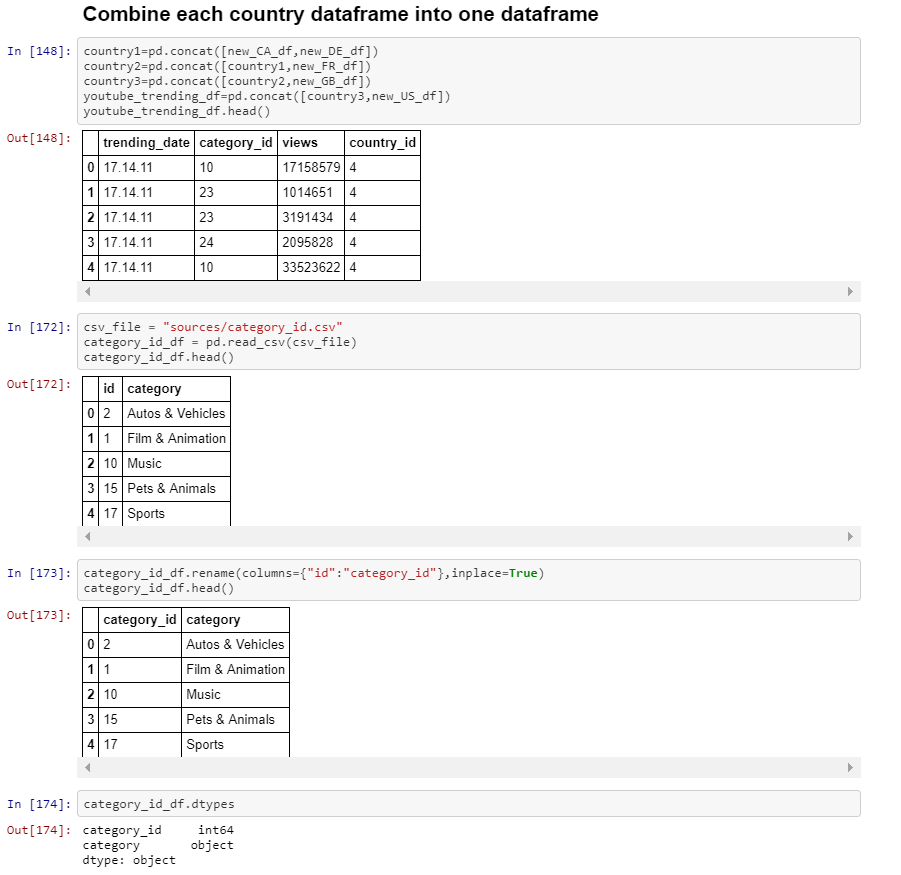
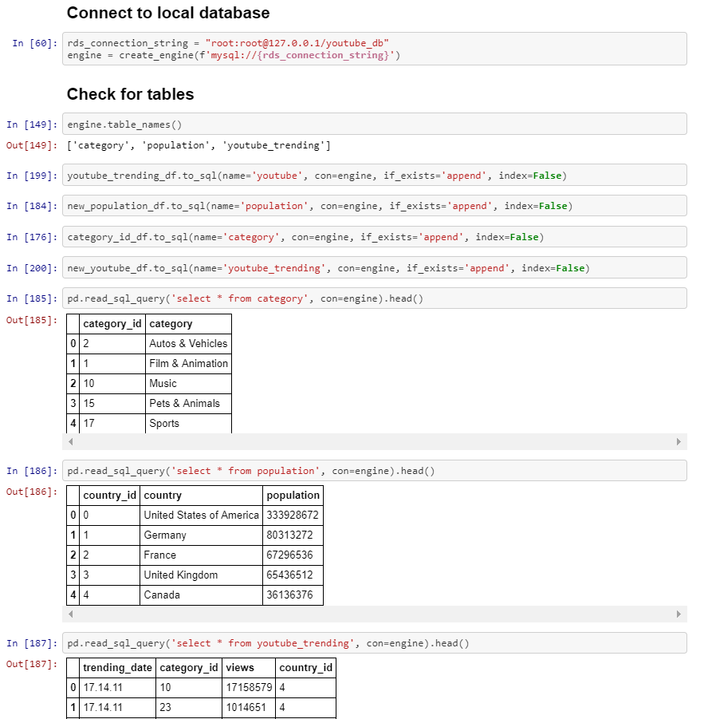

# ETL-project-2
Using two different databases (Youtube data and world population datasets) in an ETL project in which we join the datasets after cleaning, and load it into an SQL database

# Data Sources:

- Youtube data
: https://www.kaggle.com/datasnaek/youtube-new 

- World population data 
: http://www.geoba.se/population.php?pc=world&page=3&type=28&st=rank&asde=DESC&year=2019 

- Youtube category index 
: https://gist.github.com/dgp/1b24bf2961521bd75d6c 

# Exctaction:

* Each 5 countries youtube trending files (.csv) into each pandas DataFrames

* Youtube categories file (.csv) into pandas DataFrame

* World population CSV file (.csv) into pandas DataFrame

## Tranformation:

* `5 country youtube trending DataFrames`

**Copy** new data frames with only three columns that we need from the YouTube trending data frame in five countries
 
  ['trending_date', 'category_id', 'views']
  

* `Youtube category DataFrame`

 **Rename** `id` column to `category_id`column.
 

* `World population DataFrame `

**Extracts** the population of five countries.

  ['Canada', 'United States of America', 'United Kingdom', 'France', 'Germany']

**Create** the `country_id` column for each country.

# Load:
  * Create a connection to the SQLdatabase.
  
  
  
  * Join between `population table` and `youtube table`on `country_id`
  
  **Foreign key** : `country_id` in population table
  **Reference key** : `country_id` in youtube table
  
  * Join between `category table` and `youtube table` on `category_id`
  
  **Foreign key** : `category_id` in category table
  **Reference key** : `category_id` in youtube table
  
 
 
  
  
